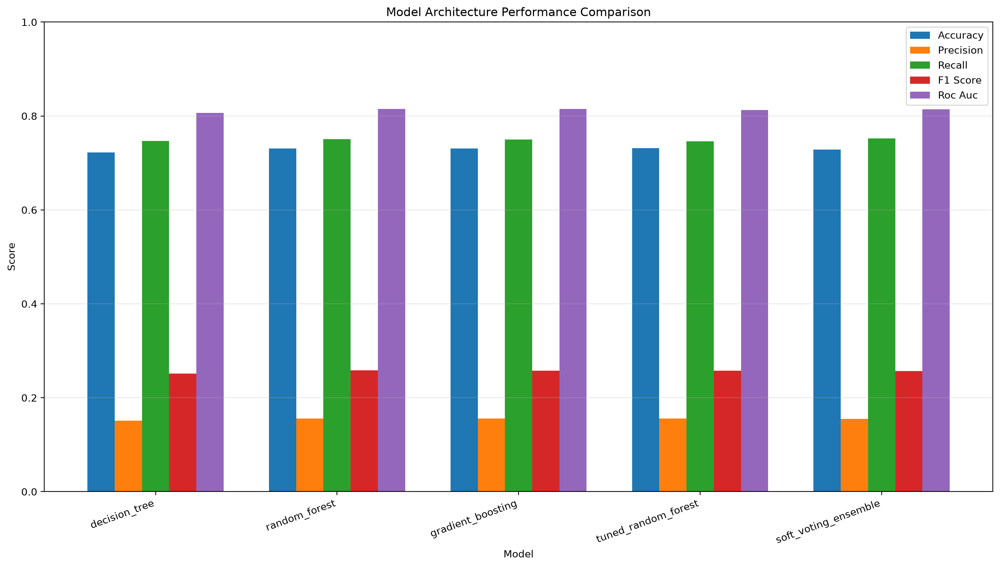
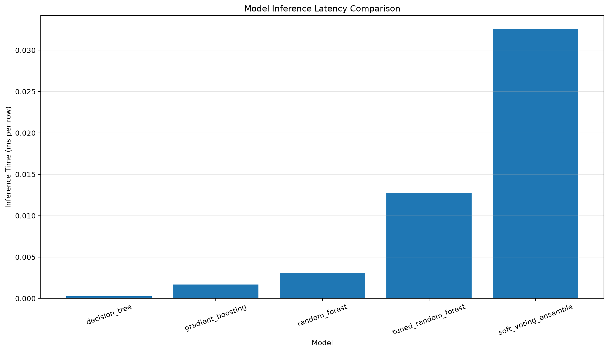

# Phase 2 - Task 3: Model Architecture Comparison

## 1. Objective

The objective of this task is to compare multiple machine learning
architectures for the customer-product reorder prediction problem.

The comparison includes tree-based models, ensemble methods, and the
tuned Random Forest from Phase 2 Task 2.

The models are evaluated using classification performance metrics and
inference latency to assess their suitability for customer analytics
and near-real-time prediction.

## 2. Models Compared

1. Decision Tree
2. Random Forest
3. Gradient Boosting
4. Tuned Random Forest
5. Soft Voting Ensemble

The Soft Voting Ensemble combines the predicted probabilities from the
Decision Tree, Random Forest, and Gradient Boosting models by averaging
their probabilities.

## 3. Evaluation Metrics

The following metrics are used:

- Accuracy
- Precision
- Recall
- F1 Score
- ROC-AUC
- Inference latency
- Serialized model size

ROC-AUC is given particular importance because the reorder prediction
dataset is imbalanced and accuracy alone can be misleading.

## 4. Test Dataset

The same final test dataset used in the previous tasks is used for
model comparison. This ensures that all architectures are evaluated
under the same conditions.

Customer and product identifiers are retained for traceability but are
not used as predictive features.

## 5. Results

| model                |   accuracy |   precision |   recall |   f1_score |   roc_auc |   inference_ms_per_row |   model_size_mb |
|:---------------------|-----------:|------------:|---------:|-----------:|----------:|-----------------------:|----------------:|
| decision_tree        |   0.722555 |    0.150918 | 0.746798 |   0.251094 |  0.806749 |               0.000252 |        0.51455  |
| random_forest        |   0.731073 |    0.155771 | 0.750731 |   0.258007 |  0.81521  |               0.003081 |      197.519    |
| gradient_boosting    |   0.730815 |    0.155557 | 0.75017  |   0.25768  |  0.815208 |               0.001689 |        0.464165 |
| tuned_random_forest  |   0.731665 |    0.155414 | 0.746092 |   0.257243 |  0.813112 |               0.012761 |       11.1538   |
| soft_voting_ensemble |   0.728517 |    0.154669 | 0.752234 |   0.256582 |  0.814541 |               0.03254  |      198.498    |

## 6. Best Performing Architecture

Based on ROC-AUC, the highest-performing architecture was:

**random_forest**

with:

- Accuracy: 0.7311
- Precision: 0.1558
- Recall: 0.7507
- F1 Score: 0.2580
- ROC-AUC: 0.8152
- Inference latency: 0.003081 ms/row

The final recommendation should consider both predictive quality and
inference cost rather than selecting a model using accuracy alone.

## 7. Ensemble Analysis

The Soft Voting Ensemble combines three complementary tree-based
architectures:

- Decision Tree
- Random Forest
- Gradient Boosting

Soft voting averages the predicted probability of the positive class
from each model. This approach can reduce dependence on the behavior
of any single architecture and may improve ranking performance.

The ensemble is compared against the individual models using the same
test data and metrics.

## 8. Hyperparameter Tuning Context

The Tuned Random Forest was selected during Phase 2 Task 2 using
cross-validation based on ROC-AUC.

The best cross-validation ROC-AUC was approximately **0.8110**.


### Task 2 Tuned Random Forest Parameters

```text
Phase 2 - Task 2 Best Random Forest Parameters
=================================================

n_estimators: 75
min_samples_split: 10
min_samples_leaf: 5
max_features: log2
max_depth: 10
bootstrap: True

Best cross-validation ROC-AUC: 0.810995
```


### Task 2 Validation and Final Test Results

| evaluation_stage   |   accuracy |   precision |   recall |   f1_score |   roc_auc |
|:-------------------|-----------:|------------:|---------:|-----------:|----------:|
| validation         |   0.7408   |    0.736153 | 0.75064  |   0.743326 |  0.814491 |
| final_test         |   0.731665 |    0.155414 | 0.746092 |   0.257243 |  0.813112 |


## 9. Inference and Production Considerations

Inference latency was measured on the final test dataset.

A model with slightly better predictive performance may not always be
the best production choice if its inference cost is substantially
higher.

The comparison therefore considers:

- Predictive performance
- ROC-AUC
- F1 Score
- Recall
- Inference latency
- Model size
- Ensemble complexity

For large-scale customer analytics, Random Forest and tuned Random
Forest provide a useful balance between predictive performance and
model complexity.

Gradient Boosting may provide competitive predictive performance but
requires substantially more training time in this project.

The Soft Voting Ensemble provides a way to combine multiple model
architectures, but its inference cost is higher because multiple
models must be executed.

## 10. Key Findings

- Tree-based architectures are effective for the engineered
  customer-product features.
- Random Forest provides stronger ROC-AUC than the standalone Decision
  Tree in the Task 1 comparison.
- Gradient Boosting achieves performance close to Random Forest but has
  considerably higher training cost in this experiment.
- Hyperparameter tuning improves the Random Forest configuration and
  provides a more controlled model complexity.
- Soft voting demonstrates how multiple architectures can be combined
  for ensemble prediction.
- Accuracy should not be used as the only selection criterion because
  the target variable is imbalanced.
- ROC-AUC, F1 Score, recall, and inference latency are important when
  selecting a model for customer analytics.

## 11. Visualizations

### Model Performance



### Inference Latency



## 12. Conclusion

The model architecture comparison demonstrates that ensemble-based
tree models are strong candidates for customer-product reorder
prediction.

The final architecture should be selected by balancing predictive
performance with inference efficiency. For a production customer
analytics workflow, the tuned Random Forest is a strong baseline,
while the Soft Voting Ensemble can be considered when the additional
inference cost is justified by improved predictive performance.

This task completes the architecture comparison stage and provides the
basis for selecting the model configuration for subsequent evaluation
and documentation.
